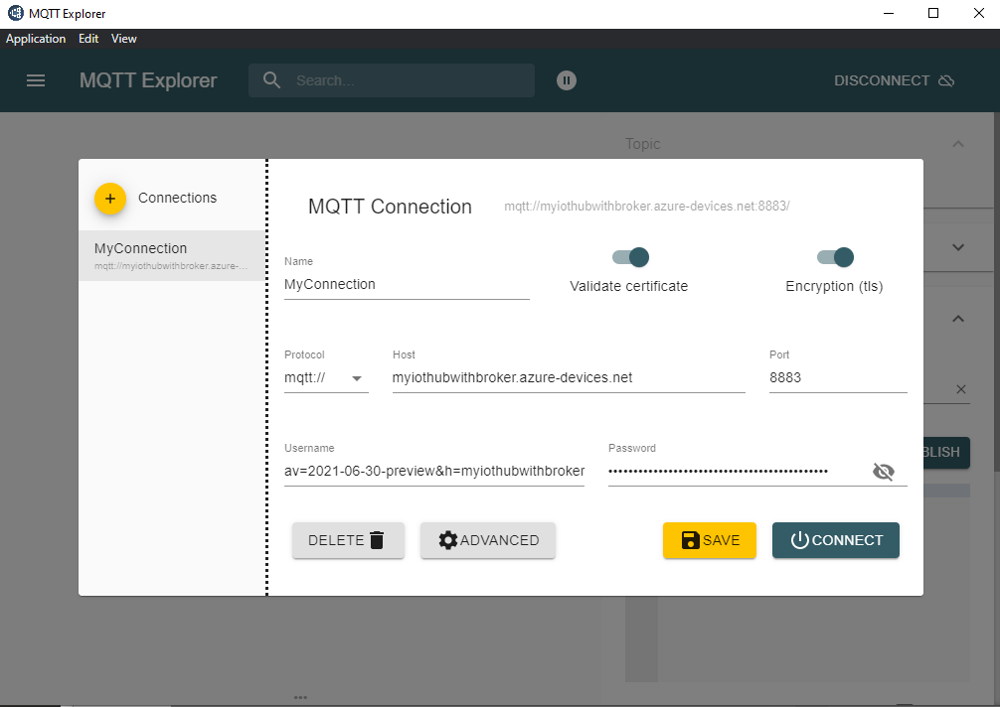
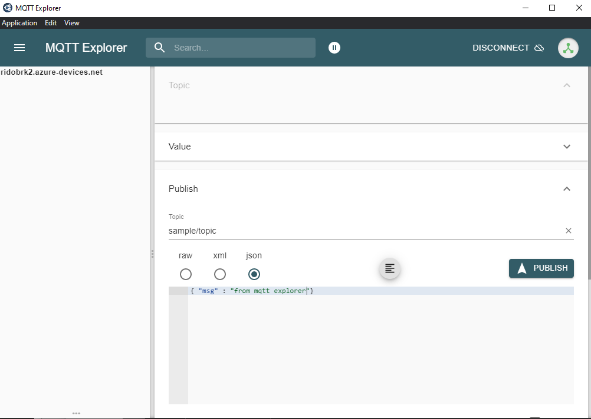

# Using existing MQTT clients to connect to IoT Hub MQTT Broker

IoT Hub MQTT Broker support MQTT v3.1.1, as such existing MQTT clients can be used to connect, publish and subscribe to topics.

## Subscribe with Mosquitto

[Mosquitto](https://mosquitto.org/) is a popular open source MQTT broker that includes CLI commands to publish/subscribe, you can use these tools to interact with the IoT Hub MQTT Broker.

### Install Mosquitto

For Linux, or WSL running on Windows you can get mosquitto with the proper package manager, eg, for Ubuntu:

```bash
sudo apt upgrade
sudo apt install mosquitto mosquitto-clients
```

>Note: Installation instructions for other platforms [https://mosquitto.org/download/](https://mosquitto.org/download/)

### Subscribe with mosquitto_sub

Connecting to IoT Hub MQTT broker requires to create the credentials for each device, the `az iot hub device-identity generate-mqtt-credentials` command (requires the preview CLI version available [here](../README.md#prerequisites) ) allows to create the USERNAME and PASSWORD required to establish a connection based on the device SaS Keys.

>Note: You must `az login` in the CLI and make sure you are using the subscription used to create the hub `az account set -s <subscription_name>`

The script [./mosquitto_sub.sh](./mosquitto_sub.sh) shows how to retrieve the credentials, and also create the device identity if it does not exist, and invoke the `mosquitto_sub` command with appropiate parameters to subscribe to the topic `sample/topic`.

For example, to connect to a device named `device01` in your hub `myhubwithbroker` run:

```bash
chmod +x ./mosquitto_sub.sh
./mosquitto_sub.sh myhubwithbroker device01
```
>Note: the script refernces the [BaltimoreCA.pem](./BaltimoreCA.pem) certificate

After a successfull connection, and subscribed to the topic `sample/topic` you should expect the next output:

```text
hostname: myhubwithbroker.azure-devices.net
clientid: device01
username: av=2021-06-30-preview&h=myhubwithbroker.azure-devices.net&did=device01&am=SASb64&se=1630549494000&sa=1630545894000
password: ABCD1234ABCD1234ABCD1234ABCD1234ABCD1234ABC=

 Connect with Mosquitto 

Client device01 sending CONNECT
Client device01 received CONNACK (0)
Client device01 sending SUBSCRIBE (Mid: 1, Topic: sample/topic, QoS: 0, Options: 0x00)
Client device01 received SUBACK
Subscribed (mid: 1): 0
```

### Publish with MQTT Explorer

[MQTT Explorer](https://mqtt-explorer.com/) is a popular GUI tool you can use to publish/subscribe to any MQTT compliant broker. Once you installed the tool you need to configure the connection with the next options:
- Name: The name of your connection
- Validate Certificate: enabled
- Encryption (tls): enabled
- Protocol: mqtt://
- Host: myiothubwithbroker.azure-devices.net
- Port: 8883
- Username: <copy/paste the user name obtained with az iot hub device-identity generate-mqtt-credentials >
- Password: <copy/paste the user password obtained with az iot hub device-identity generate-mqtt-credentials >
- Advanced/ClientId: <your device id>
- Advanced/Certificate/Server Certificate (CA): path to BaltimoreCA.pem



Once connected you should be able to publish a message to the 'sample/topic' 



and it should be displayed in the CLI subscribed in the previous step.
```
 Connect with Mosquitto 

Client device01 sending CONNECT
Client device01 received CONNACK (0)
Client device01 sending SUBSCRIBE (Mid: 1, Topic: sample/topic, QoS: 0, Options: 0x00)
Client device01 received SUBACK
Subscribed (mid: 1): 0
Client device01 received PUBLISH (d0, q0, r0, m0, 'sample/topic', ... (31 bytes))
sample/topic { "msg" : "from mqtt explorer"}
```